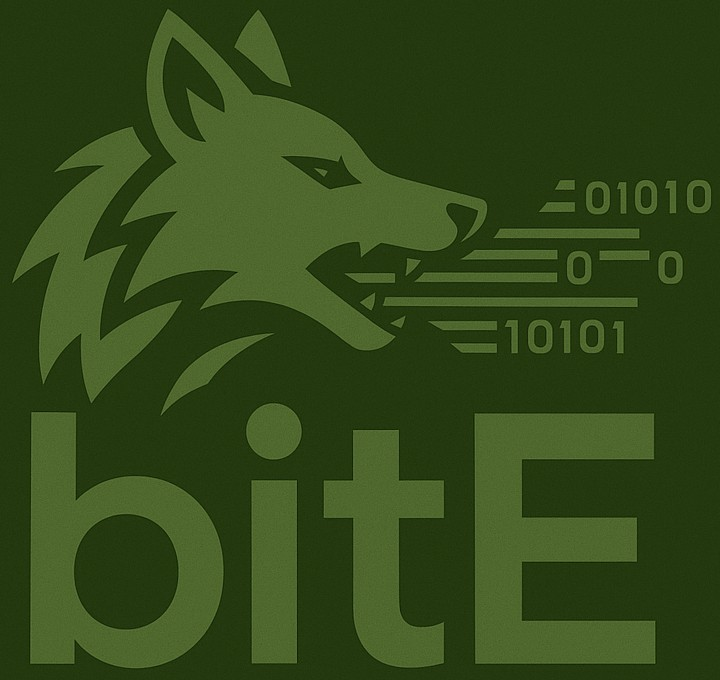

# bitE



---

## Overview

The `bitE` project provides a single-header C89 library for low-level, bit-wise read and write operations. It is designed to work in systems with limited resources (e.g., embedded platforms), focusing on performance, transparency, and debugging. It follows MISRA guidelines, avoids dynamic memory allocation, and is free of multithreading. It is compatible with CAN DBC.

---

## Features

- Read/write bitfields up to 8 bits
- Configurable endianness
- Debugging support (`BITE_DEBUG`)
- Status flags for overflow and underflow
- Modular, driver-agnostic approach
- Constant time complexity
- Stream design: Write and read byte by byte

---

## File structure

- `bite.h`: Single-header library containing all logic
- `bite.test.c`: Test file used to confirm correct logic
- `make.sh`: Builds test (requires cppcheck with MISRA headlines)
- `README.md`: Project documentation

---

## Key data structures

### `struct bite`

| Field        | Description                       |
|--------------|-----------------------------------|
| `_data`      | Pointer to data buffer           |
| `_ofs_bits`  | Start bit offset                 |
| `_len_bits`  | Total bit length                 |
| `_iter_bits` | Current bit offset               |
| `flags`      | Status flags                     |
| `_order`     | Endianness (`BITE_ORDER_*`)      |
| `debug`      | Debug flag (if `BITE_DEBUG` set) |
| `nest`       | Debug nesting (if `BITE_DEBUG`)  |

---

## API

### Initialization

```c
void bite_init(struct bite *self, uint8_t *buf);
````

Initializes the `bite` context.

---

### Begin/End bit-wise operation

```c
void bite_begin(struct bite *self, size_t ofs_bits, size_t len_bits, enum bite_order order);
void bite_end(struct bite *self);
```

Starts/ends a bit-wise operation on a range.

---

### Rewind

```c
void bite_rewind(struct bite *self);
```

Resets iteration.

---

### Write bits

```c
void bite_write(struct bite *self, uint8_t data);
```

Writes up to 8 bits.

---

### Read bits

```c
uint8_t bite_read(struct bite *self);
```

Reads up to 8 bits.

---

### Debugging (enabled via `-DBITE_DEBUG`)

When compiled with `BITE_DEBUG`, debug logs show detailed tracing of all read/write operations, including binary representation and intermediate calculations. Logs are color-coded.

---

## Usage Example

```c
#include "bite.h"

uint8_t data[4] = {0};
struct bite b;

bite_init(&b, data);

/* Begin operation with offset of 3 bits, and length of 5 (CAN DBC format) */
bite_begin(&b, 3, 5, BITE_ORDER_BIG_ENDIAN);

/* Write exactly 5 bits (remaining MSB bits WILL BE masked) */
bite_write(&b, 0x1F);
bite_end(&b);
```

For more usage examples see test file.

## Debug output example


---

## Building

The library is a single-header file (`bite.h`). Include it directly:

```c
#include "bite.h"
```

To enable debugging:

```
gcc -DBITE_DEBUG ...
```

---

## Contributing

Bug reports, suggestions, and improvements are welcome!

---

## License

MIT License.

---

## Contact

For questions or contributions, open an issue or pull request.

---
